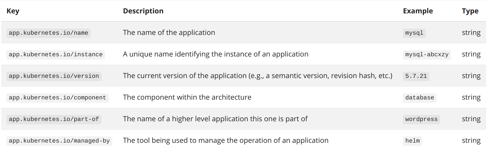

# Overview

了解 kubernetes 的大概轮廓及其基本组件。

## What is kubernetes

Kubernetes 是一个可移植的、可扩展的开源平台，用于管理容器化的工作负载和服务，可促进声明式配置和自动化。Kubernetes 拥有一个庞大且快速增长的生态系统。Kubernetes 的服务、支持和工具广泛可用。


容器部署时代：共享操作系统，因此是轻量级的。容器具有自己的文件系统、CPU、内存、进程空间等等。

容器具有的优势：

- 敏捷应用程序的创建和部署。
- 持续开发、集成和部署。
- 开发与运维分离。
- 除了操作系统用级别的信息、还可以观测到应用的其他信息。
- 跨开发、测试和生产的环境一致性。
- 云和操作系统分发的可移植性。
- 以应用程序为中心的管理。
- 松耦合、分布式、弹性、解放的微服务。
- 资源隔离：可预测的应用程序性能。
- 资源利用：高效率和高密度。

kubernetes 能提供的功能：

- 服务发现和负载均衡。
- 存储编排。
- 自动部署和回滚。
- 自动二进制打包。
- 自我修复;。
- 密钥和配置管理。

kubernetes 的特性：

- 不限制应用类型，只要能在 Container 中运行就能在 kubernetes 中运行。
- 不部署源码，也不构建应用程序。
- 不提供应用级别的服务，如中间件、数据库等等。
- 不指定日志记录、监视或警报解决方案。
- 不提供也不要求用户配置语言或系统。
- Kubernetes 不只是一个编排系统，它反而消除了编排的需要。

<https://kubernetes.io/docs/concepts/overview/what-is-kubernetes/>

## kubernetes 组件

一个 kubernetes 集群由一个 Control Plane 和多个 node 组成。
nodes 作为 Pods 的宿主机， control plane 管理集群中的 pods 和 nodes。
在生产环境中，control plane 一般存在于多台机器上，这样是为了保证其故障转移和高可用的特性。


### Control Plane 组件

Control Plane 用于做全局的决策和调度。一般来说，Control Plane 会和工作机分离。Control Plane 主要有以下几种组件：

#### 1. kube-apiserver

Kubernetes control plane 的前端，提供了 kubernetes 的 API。

#### 2. etcd

Kubernetes 集群的后台数据库，具有一致性、高可用的特性。

#### 3. kube-scheduler

用于监测没有分配 node 的新建的 pods，当出现该情况时，为这些 pods 分配 node。

#### 4. kube-controller-manager

运行 controller 进程的组件。这些 controller 有：

- Node controller：负责在节点出现故障时进行通知和响应。
- Replication controller：负责为系统中的每个副本中的对象维护正确数量的 Pod。
- Endpoints controller：用于增加 Service 和 Pod。
- Service Account & Token controller：为新的 namespace 创建默认帐户和 API 访问授权令牌。

#### 5. cloud-controller-manager

进行云上逻辑控制的组件。能让集群连接到云服务商提供的 API。

### Node 组件

在每个 node 上运行的组件，维护运行的 Pod 并提供 Kubernetes 的运行环境。
这些组件主要有：

#### 1. kubelet

运行在每个 node 上的一个代理组件。用于保证 container 都运行在 pod 中。
kubelet 会接收一组通过各种机制提供给它的 PodSpecs，确保这些 PodSpecs 中描述的容器处于运行状态且健康。kubelet 只会管理由 Kubernetes 创建的容器。

#### 2. kube-proxy

运行在每个 node 上的一个网络代理组件，是实现 Service 的一部分。kube-proxy 用于维护 nodes 上的网络规则。这些网络规则允许从集群内部或外部与 Pod 进行通信。

#### 3. Container runtime

用于运行 container。

### 插件

插件使用 Kubernetes 资源 (DaemonSet, Deployment 等) 来实现集群功能。因为这些功能是集群级别的，所以插件的资源属于 kube-system namespace。
这些插件主要有：

#### 1. DNS

所有的 kubernetes 集群有需要有一个 Cluster DNS（<https://kubernetes.io/docs/concepts/services-networking/dns-pod-service/>）。Cluster DNS 用于 kubernetes services 的 DNS 服务。

#### 2. Web UI(Dashboard)

用于管理集群中运行的应用程序、集群本身并进行故障排除等。

#### 3. Container Resource Monitoring

将关于容器的一些常见的时间序列存到数据库中。

#### 4. Cluster-level Logging

负责将容器的日志数据保存到一个集中的日志存储中，并提供了搜索和浏览接口。

<https://kubernetes.io/docs/concepts/overview/components/>

## The Kubernetes API

kubernetes control plane 的核心是 API server。通过 kubernetes API，能够操控 kubernetes 对象（如 Pods, Namespaces, ConfigMaps, and Events 等等）。

### API versioning

#### 1. Alpha level

- 版本名称包含了 alpha (例如：v1alpha1)。
- 可能是有缺陷的。
- 支持的功能可能会删除。
- API的更改可能会带来兼容性问题。
- 由于bugs风险的增加和缺乏长期的支持，推荐在短暂的集群测试中使用。

#### 2. Beta level

- 版本名称包含了 beta (例如: v2beta3)。
- 代码已经测试过。启用该功能被认为是安全的，功能默认已启用。
- 所有已支持的功能不会被删除，细节可能会发生变化。
- 对象的模式或语义可能会在后续的 beta 测试版中以不兼容的方式进行更改。
- 建议仅用于非业务关键型用途，因为后续版本中可能存在不兼容的更改。
- 请尝试 beta 版本功能并且给出反馈！

#### 3. Stable level

- 版本名称是 vX，其中 X 是整数 (例如：v2)。
- 功能的稳定版本将出现在许多后续版本的发行软件中。

### API groups

引入 API groups 是为了使 API 更容易进行扩展。一般来说需要在 REST path 或 apiVersion 字段中指定。

主要有以下两种 API groups：

#### 1. 核心组（也叫遗留组）

REST path 中：`/api/v1`
apiVersion 中：`apiVersion: v1`

#### 2. 命名组

REST path 中：`/apis/$GROUP_NAME/$VERSION`
apiVersion 中：`apiVersion: $GROUP_NAME/$VERSIO`，例如 `apiVersion: batch/v1`

在 kubernetes 中，主要有以下两种使用自定义资源 （custom resources）扩展 API 的方法：

- CustomResourceDefinition
- 实现自己的 API server 扩展

### Enabling or disabling API groups

默认是启用的，但也可以手动设置，例如，禁用 batch/v1

`--runtime-config=batch/v1=false`，

启用 batch/v2alpha1

`--runtime-config=batch/v2alpha1`

<https://kubernetes.io/zh/docs/concepts/overview/kubernetes-api/>

## kubernetes 对象

Kubernetes 对象是 Kubernetes 系统中的持久化实体。Kubernetes 使用这些实体来表示集群状态。

### 理解 kubernetes 对象

kubernetes 对象用于描述：

- 哪些容器化应用正在运行，以及运行在哪些 nodes 上。
- 那些应用可以拿到的资源有哪些。
- 应用运行时的策略，如重启策略、升级策略、容错策略等等。

kubernetes 对象是一个“意图的记录”，一旦对象被创建， kubernetes 将会一直保证该对象的持久化。

通过创建 kubernetes 对象，来告知 Kubernetes 系统所需要的集群工作负载看起来是什么样子的。叫做集群的 “desired state”。

无论是创建、修改还是删除 kubernetes 对象，都需要通过 kubernetes API 来完成，包括 `kubectl` 命令或 kubernetes 的 API 库。

#### 对象的 Spec 与 Status

每个 Kubernetes 对象都包含两个可嵌套的字段：Spec 和 Status。spec 是必需的，它描述了对象的期望状态（Desired State）。status 描述了对象的实际状态（Actual State），由 Kubernetes 系统负责提供和更新的。

任何时刻，Kubernetes control plane 会一直让对象的实际状态与期望状态相匹配。

例如：Deployment 对象用于表示运行在集群中的程序。当创建一个 Deployment 对象时，可以指定需要运行的应用的 replica 数为 3。kubernetes 将会读取该 Deployment 对象的 Spec 字段，并开启三个应用的实例。如果这 3 个实例中的一个挂掉了， kubernetes 将会重启一个实例，以达到消除 Spec 与 Status 之间差异的目的。

#### 描述一个 kubernetes 对象

创建一个 kubernetes 对象时必须要提供 Spec 和一些基础的信息（例如 name）。然后给  kubectl 提供一个带有这些信息的 yaml 文件，kubectl 会自动解析并完成 API 请求。

##### 示例

```yaml
apiVersion: apps/v1 # for versions before 1.9.0 use apps/v1beta2
kind: Deployment
metadata:
  name: nginx-deployment
spec:
  selector:
    matchLabels:
      app: nginx
  replicas: 2 # tells deployment to run 2 pods matching the template
  template:
    metadata:
      labels:
        app: nginx
    spec:
      containers:
      - name: nginx
        image: nginx:1.14.2
        ports:
        - containerPort: 80
```

使用如下命令来创建一个 Deployment 对象：

```bash
kubectl apply -f https://k8s.io/examples/application/deployment.yaml --record
```

输出：

```bash
deployment.apps/nginx-deployment created
```

#### Required Fields

创建一个 kubernetes 对象，必须要给以下字段提供 value：

- apiVersion
- kind（对象的类型）
- metadata（用于做唯一识别，包括 name、UID、namespace 等）
- spec

### kubernetes 对象管理

#### 1. 命令式指令

`kubectl create deployment nginx --image nginx`

#### 2. 命令式对象配置

```bash
kubectl create -f nginx.yaml
kubectl delete -f nginx.yaml -f redis.yaml
kubectl replace -f nginx.yaml
```

#### 3. 声明式对象配置

处理 configs 目录中的所有 yaml 文件，创建并更新对象。可以先使用 diff 命令查看将要进行的更改：

```bash
kubectl diff -f configs/
kubectl apply -f configs/
```

递归处理 configs 目录：

```bash
kubectl diff -R -f configs/
kubectl apply -R -f configs/
```

### name & IDs

name 用于区分同一种资源的不同对象，UID 用于区分集群中的不同对象。

也就是说集群中可以同时存在 name 为 `myapp-1234` 的一个 pod 和一个 deployment。

#### Names

一个由客户端提供的 string，用来指向一个在资源 URL 中的对象。例如：`/api/v1/pods/some-name`。

以下是一个名为 nginx-demo 的 pod示例：

```yaml
apiVersion: v1
kind: Pod
metadata:
  name: nginx-demo
spec:
  containers:
  - name: nginx
    image: nginx:1.14.2
    ports:
    - containerPort: 80
```

#### IDs

由 kubernetes 系统自动生成的用于区分对象的字符串。

使用命令查看 nginx-demo 的 uid：

```bash
kubectl get pods nginx-demo -o yaml | grep uid
```

输出：

```bash
uid: 9f1287bb-b75f-4901-a2f8-aaf810e108e4
```

#### Namespaces

用于在同一个物理集群上支持多个虚拟集群。

列出当前集群的 namespaces：

```bash
kubectl get namespace
```

输出：

```bash
NAME              STATUS   AGE
default           Active   6d18h
kube-node-lease   Active   6d18h
kube-public       Active   6d18h
kube-system       Active   6d18h
```

以上为 kubernetes 初始化的 namespaces：

- default，没有指定 namespace 的对象的缺省所属。
- kube-system，由 kubernetes 系统创建的对象所属。
- kube-public，所有用户都可以访问和使用。
- kube-node-lease，与每个 node 都有关联的租赁对象所属。

##### 设置请求的 namespace

```bash
kubectl run nginx --image=nginx --namespace=<insert-namespace-name-here>
kubectl get pods --namespace=<insert-namespace-name-here>
```

##### 设置当前的 namespace

使用如下命令设置 namespace，这意味着之后不需要再添加 `--namespace` 参数：

```bash
kubectl config set-context --current --namespace=<insert-namespace-name-here>
# Validate it
kubectl config view --minify | grep namespace:
```

##### namespaces 与 DNS

当创建了一个 Service 时，相应的会产生一个 DNS entry。该 entry 的形式为 `<service-name>.<namespace-name>.svc.cluster.local`。这意味着如果容器只使用 `<service-name>`，那么它将被解析到本地 namespace 的 service 中。

##### 并非所有对象都在同一个 namespace

大多数对象（pods,services 等）都在同一个 namespace，然而对于一些较为底层的对象（nodes，persistentVolumes 等），它们所处的 namespace 不同。

使用如下命令查看哪些资源是在同一个或不同的 namesapce：

```bash
# In a namespace
kubectl api-resources --namespaced=true

# Not in a namespace
kubectl api-resources --namespaced=false
```

#### Labels & Selectors

Labels 是对象中 k-v 形式的键值对，用于指定对用户而言有意义的标识属性。可以在创建时指定，也可以在创建后随时更改或添加。

##### Label selectors

用于对象分组。可使用`，`（意为`&&`）进行多次 selector。selector 主要有两种 selector：

###### 1. Equality-based requirement

`=，==，！=`

例如：

```bash
environment = production
tier != frontend
```

值得注意的是，`！=`除了选取所有带有 tier key，value 不等于 frontend 的资源之外，还会选取没有 tier key 的资源。

一个使用实例就是 pod 指定 node。例如：

```yaml
apiVersion: v1
kind: Pod
metadata:
  name: cuda-test
spec:
  containers:
    - name: cuda-test
      image: "k8s.gcr.io/cuda-vector-add:v0.1"
      resources:
        limits:
          nvidia.com/gpu: 1
  nodeSelector:
    accelerator: nvidia-tesla-p100
```

###### 2. Set-based requirement

`in`, `notin`, `exists`（仅用于对 key 进行表标识）

例如：

```bash
environment in (production, qa)
tier notin (frontend, backend)
partition # 带有 partition key 的资源，没有 value 检查
!partition # 不带有 partition key 的资源，没有 value 检查
```

##### API LIST and WATCH filtering

例如：

基于 equality-based：

```bash
kubectl get pods -l environment=production,tier=frontend
```

基于 set-based：

```bash
kubectl get pods -l 'environment in (production),tier in (frontend)'
```

###### 1. Service and ReplicationController

仅支持 equality-based selector，例如：

```yaml
selector:
    component: redis
```

###### 2. 支持 set-based 的资源

例如 Job、Deployment、ReplicaSet、DaemonSet 等。

```yaml
selector:
  matchLabels:
    component: redis
  matchExpressions:
    - {key: tier, operator: In, values: [cache]}
    - {key: environment, operator: NotIn, values: [dev]}
```

#### Annotations

为对象添加的附属信息 metadata，不用于唯一标识。与 label 相比，格式要求不严格，可大可小，可以是结构化的，也可以是非结构化的。

使用场景举例：

- 由声明性配置所管理的字段。将这些字段附加为注解，能够将客户端与服务端设置的字段区分开来。
- 构建、发布或镜像信息（如时间戳、发布 ID、Git 分支、PR 数量、镜像哈希、仓库地址等）。
- 指向日志记录、监控。
- 可用于调试目的的客户端库或工具信息：例如，名称、版本和构建信息。
- 用户或者工具的来源信息，例如来自其他生态系统组件的相关对象的 URL。
- 推出的轻量级工具的元数据信息：例如，配置或检查点。
- 负责人员的电话或呼机号码，或指定在何处可以找到该信息的目录条目，如团队网站。

annotations 也是 k-v 键值对的形式，例如：

```yaml
apiVersion: v1
kind: Pod
metadata:
  name: annotations-demo
  annotations:
    imageregistry: "https://hub.docker.com/"
spec:
  containers:
  - name: nginx
    image: nginx:1.14.2
    ports:
    - containerPort: 80
```

#### Field Selectors

用于通过一个或多个字段选取资源。

例如：

```bash
kubectl get pods --field-selector status.phase=Running
```

所有的资源类型都支持对字段 `metadata.namespace` 和 `metadata.name` 的选取。

Field Selector 同样支持操作符：`=，==，！=`。例如：

```bash
kubectl get services  --all-namespaces --field-selector metadata.namespace!=default
```

链式 selector，例如，筛选 status.phase 字段不等于 Running 同时 spec.restartPolicy 字段等于 Always 的所有 Pod：

```bash
kubectl get pods --field-selector=status.phase!=Running,spec.restartPolicy=Always
```

多种资源类型的选取，例如，筛选出所有不在 default 命名空间中的 StatefulSet 和 Service：

```bash
kubectl get statefulsets,services --all-namespaces --field-selector metadata.namespace!=default
```

#### Recommended Labels

使用这些标签，可以使得应用管理更加简单便捷。



例如：

```yaml
apiVersion: apps/v1
kind: StatefulSet
metadata:
  labels:
    app.kubernetes.io/name: mysql
    app.kubernetes.io/instance: mysql-abcxzy
    app.kubernetes.io/version: "5.7.21"
    app.kubernetes.io/component: database
    app.kubernetes.io/part-of: wordpress
    app.kubernetes.io/managed-by: helm
```

##### 一个简单的无状态 Service 示例

deployment 用于监督应用的 pods：

```yaml
apiVersion: apps/v1
kind: Deployment
metadata:
  labels:
    app.kubernetes.io/name: myservice
    app.kubernetes.io/instance: myservice-abcxzy
...
```

service 用于暴露该应用：

```yaml
apiVersion: v1
kind: Service
metadata:
  labels:
    app.kubernetes.io/name: myservice
    app.kubernetes.io/instance: myservice-abcxzy
...
```

<https://kubernetes.io/docs/concepts/overview/working-with-objects/>
