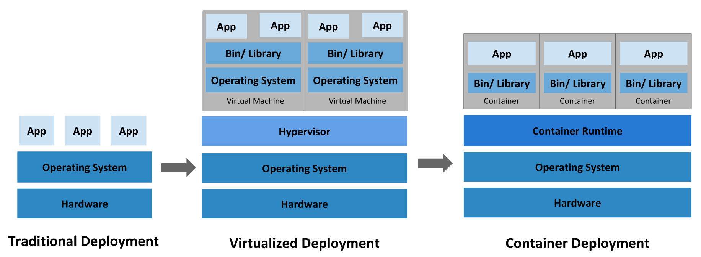

# Concepts

## Overview

了解 kubernetes 的大概轮廓及其基本组件。

### What is kubernetes

Kubernetes 是一个可移植的、可扩展的开源平台，用于管理容器化的工作负载和服务，可促进声明式配置和自动化。Kubernetes 拥有一个庞大且快速增长的生态系统。Kubernetes 的服务、支持和工具广泛可用。

容器部署时代：共享操作系统，因此是轻量级的。容器具有自己的文件系统、CPU、内存、进程空间等等。

容器具有的优势：

- 敏捷应用程序的创建和部署。
- 持续开发、集成和部署。
- 开发与运维分离。
- 除了操作系统用级别的信息、还可以观测到应用的其他信息。
- 跨开发、测试和生产的环境一致性。
- 云和操作系统分发的可移植性。
- 以应用程序为中心的管理。
- 松耦合、分布式、弹性、解放的微服务。
- 资源隔离：可预测的应用程序性能。
- 资源利用：高效率和高密度。

kubernetes 能提供的功能：

- 服务发现和负载均衡。
- 存储编排。
- 自动部署和回滚。
- 自动二进制打包。
- 自我修复;。
- 密钥和配置管理。

kubernetes 的特性：

- 不限制应用类型，只要能在 Container 中运行就能在 kubernetes 中运行。
- 不部署源码，也不构建应用程序。
- 不提供应用级别的服务，如中间件、数据库等等。
- 不指定日志记录、监视或警报解决方案。
- 不提供也不要求用户配置语言或系统。
- Kubernetes 不只是一个编排系统，它反而消除了编排的需要。

<https://kubernetes.io/docs/concepts/overview/what-is-kubernetes/>

### kubernetes 组件

一个 kubernetes 集群由一个 Control Plane 和多个 node 组成。
nodes 作为 Pods 的宿主机， control plane 管理集群中的 pods 和 nodes。
在生产环境中，control plane 一般存在于多台机器上，这样是为了保证其故障转移和高可用的特性。

#### Control Plane 组件

Control Plane 用于做全局的决策和调度。一般来说，Control Plane 会和工作机分离。Control Plane 主要有以下几种组件：

##### 1. kube-apiserver

Kubernetes control plane 的前端，提供了 kubernetes 的 API。

##### 2. etcd

Kubernetes 集群的后台数据库，具有一致性、高可用的特性。

##### 3. kube-scheduler

用于监测没有分配 node 的新建的 pods，当出现该情况时，为这些 pods 分配 node。

##### 4. kube-controller-manager

运行 controller 进程的组件。这些 controller 有：

- Node controller：负责在节点出现故障时进行通知和响应。
- Replication controller：负责为系统中的每个副本中的对象维护正确数量的 Pod。
- Endpoints controller：用于增加 Service 和 Pod。
- Service Account & Token controller：为新的 namespace 创建默认帐户和 API 访问授权令牌。

##### 5. cloud-controller-manager

进行云上逻辑控制的组件。能让集群连接到云服务商提供的 API。

#### Node 组件

在每个 node 上运行的组件，维护运行的 Pod 并提供 Kubernetes 的运行环境。
这些组件主要有：

##### 1. kubelet

运行在每个 node 上的一个代理组件。用于保证 container 都运行在 pod 中。
kubelet 会接收一组通过各种机制提供给它的 PodSpecs，确保这些 PodSpecs 中描述的容器处于运行状态且健康。kubelet 只会管理由 Kubernetes 创建的容器。

##### 2. kube-proxy

运行在每个 node 上的一个网络代理组件，是实现 Service 的一部分。kube-proxy 用于维护 nodes 上的网络规则。这些网络规则允许从集群内部或外部与 Pod 进行通信。

##### 3. Container runtime

用于运行 container。

#### 插件

插件使用 Kubernetes 资源 (DaemonSet, Deployment 等) 来实现集群功能。因为这些功能是集群级别的，所以插件的资源属于 kube-system namespace。
这些插件主要有：

##### 1. DNS

所有的 kubernetes 集群有需要有一个 Cluster DNS（<https://kubernetes.io/docs/concepts/services-networking/dns-pod-service/>）。Cluster DNS 用于 kubernetes services 的 DNS 服务。

##### 2. Web UI(Dashboard)

用于管理集群中运行的应用程序、集群本身并进行故障排除等。

##### 3. Container Resource Monitoring

将关于容器的一些常见的时间序列存到数据库中。

##### 4. Cluster-level Logging

负责将容器的日志数据保存到一个集中的日志存储中，并提供了搜索和浏览接口。
