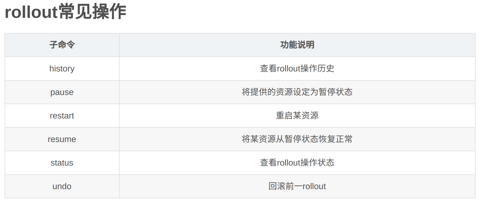

# Workloads

## Pods

pod 是 kubernetes 中最小的调度单元。一个 pod 中会有一个或多个 container，container 之间会共享存储、网络等资源，此外，pod 中还有关于如何运行 container 的说明。

通常来说，不需要单独创建一个 pod，而是使用 workload 资源进行创建（Deployment、Job 等）。如果需要跟踪 pods 的状态，那么则使用 StatefulSet 进行。

在 kubernetes 集群中，pods 主要有以下作用：

- 只运行一个 container。"one-container-per-Pod"模式是 kubenetes 中最常见的模式，这种情况下，可以认为 pod 是一个 container 的封装，kubernetes 管理 pod 而不是直接操作 container。
- 运行多个需要一起协同工作的 container。

每一个 pod 意味着一个应用程序的示例。如果需要水平扩展应用，那么就应该创建多个 pods，在 kubernetes 中，这叫做 replication。Replicated pods 通常由 workload 资源与其对应的 controlller 来进行管理。

pod 中多个 container 共享资源、互相协作。以下是其中一个使用示例：


**Pods and controllers**

Pods 被设计作是一个短暂、用后即弃的实体。当 pod 被创建后，它会被调度至 node 上运行，当 pod 执行结束后就会被驱逐（evicted）。pod 不是一个进程，而是一个运行中的 container 的环境（an environment for running container(s)）。

管理 pods 的 workload 资源有 Deployment、StatefulSet、DaemonSet 等。当一个 node 炸掉时，controller 会检测到该 node 上的 pods 都停止运行了，然后会创建新的 pods，并将它们放置于一个健康的 node 上。

**Pod templates**

示例：

```yaml
apiVersion: batch/v1
kind: Job
metadata:
  name: hello
spec:
  template:
    # This is the pod template
    spec:
      containers:
      - name: hello
        image: busybox
        command: ['sh', '-c', 'echo "Hello, Kubernetes!" && sleep 3600']
      restartPolicy: OnFailure
    # The pod template ends here
```

Deployment Controller 会保证运行的 pods 与期望状态相符。当 template 更新时，Deployment 会删除已有的 pods 并部署新的 pods。

**Resource sharing and communication**

pod 可以指定一组共享卷，所有在该 pod 中的 container 都可以使用这些卷。

每一个 pod 都会被分配一个独立的 IP 地址，所有在该 pod 中的 container 都共享该 IP 地址。在 pod 内部中，container 可以使用 localhost 互相通信。

**Privileged mode for containers（container 的特权模式）**

可以通过 `privileged` flag 为一个 container 赋予特权，这会使 container 获得操作系统的管理权限。

**Static Pods**

与其他普通 pods 不一样的是，Static pods 由 kubelet daemon 在某个特定节点上进行直接管理而不经过 API server。其主要作用是用于 kubelet 管理 control plane 组件。kubelet 会在 API server 中自动创建一个 static pod 的副本，所以对于 API server 来说，static pod 是只读的。

### Pod Lifecycle

pod 的生命周期: Pending -> Running -> Succeeded/Failed。Pod 在其生命周期中只会被调度一次，一旦其被分配到了一个 node 上后，它就会一直运行直到结束或被终止。

#### Pod lifetime

像 container 中的一个应用程序一样，pod 的寿命是短暂的。Pod 被创建时会被分配一个唯一的 ID（UID），如果一个 node 死掉了，那么其中的 pods 就会被删除。

pod 不会自我修复，如果 node 中的 pod 被调度失败了，那么它就会被删除。

一个 pod 的实例永远不会被重新调度到另一个 node 中，相应的，只会在目标 node 中创建一个新的同名的 pod，但拥有不同的 UID。如果一个 pod 实例被删除了，那么其相应的资源也会被删除。

#### Pod phase

phase 字段位于 `pod.status.phase`。

phase 只是 pod 生命周期的一个简单的高度总结，并不涵盖非常详尽的信息。


#### Container status

使用命令 `kubectl describe pod <name-of-pod>` 查看 container 信息。

- **waiting**。container 正在为运行做准备，例如正在拉取镜像时。可以使用 kubectl 查看为什么 container 处于 waiting 状态。
- **Running**。container 正在运行。以使用 kubectl 查看 container 何时开始的运行。
- **Terminated**。container 已经结束运行或失败。以使用 kubectl 查看 container 何时开始、何时运行，以及为什么失败。

#### Container restart policy

位于 `pod.spec.restartPolicy` 字段，有 Always、OnFailure、Never 三种，默认为 Always。如果 pod 中的 container 退出了，那么 kubectl 会以幂级数时间（10s，20s，40s...）进行重启。如果重启后的 container 稳定运行超过了 10 min，那么该重启时间将会被重置回 10s。

#### Pod conditions

使用命令 `kubectl describe pod <name-of-pod>` 查看 contition 信息。

- PodScheduled: the Pod has been scheduled to a node.
- ContainersReady: all containers in the Pod are ready.
- Initialized: all init containers have started successfully.
- Ready: the Pod is able to serve requests and should be added to the load balancing pools of all matching Services.

可在 yaml 文件中进行 condition 配置：


**Pod readiness**

Pod 是否就绪的一个自定义探针。在 spec.readinessGates 中进行指定，示例：

```yaml
kind: Pod
...
spec:
  readinessGates:
    - conditionType: "www.example.com/feature-1"
status:
  conditions:
    - type: Ready                              # a built in PodCondition
      status: "False"
      lastProbeTime: null
      lastTransitionTime: 2018-01-01T00:00:00Z
    - type: "www.example.com/feature-1"        # an extra PodCondition
      status: "False"
      lastProbeTime: null
      lastTransitionTime: 2018-01-01T00:00:00Z
  containerStatuses:
    - containerID: docker://abcd...
      ready: true
...
```

Pod 只有满足以下两个条件时才会被认为是 Ready 状态：

- Pod 中的所有 container 都已准备就绪。
- conditions 中指定的 readinessGates 为 `True`。

#### Container probes

Probe：kubelet 对 container 进行的周期性诊断。

kubelet 会使用 container 实现的 Handler 进行诊断，hander 类型如下：

- **ExecAction**: Executes a specified command inside the container. The diagnostic is considered successful if the command exits with a status code of 0.
- **TCPSocketAction**: Performs a TCP check against the Pod's IP address on a specified port. The diagnostic is considered successful if the port is open.
- **HTTPGetAction**: Performs an HTTP GET request against the Pod's IP address on a specified port and path. The diagnostic is considered successful if the response has a status code greater than or equal to 200 and less than 400.

每个 Probe 都会返回以下 3 种结果：

- Success: The container passed the diagnostic.
- Failure: The container failed the diagnostic.
- Unknown: The diagnostic failed, so no action should be taken.

kubelet 会在运行的 container 中选择性地执行以下 3 种 Probe：

- **livenessProbe**: Indicates whether the container is running. If the liveness probe fails, the kubelet kills the container, and the container is subjected to its restart policy. If a Container does not provide a liveness probe, the default state is Success.
- **readinessProbe**: Indicates whether the container is ready to respond to requests. If the readiness probe fails, the endpoints controller removes the Pod's IP address from the endpoints of all Services that match the Pod. The default state of readiness before the initial delay is Failure. If a Container does not provide a readiness probe, the default state is Success.
- **startupProbe**: Indicates whether the application within the container is started. All other probes are disabled if a startup probe is provided, until it succeeds. If the startup probe fails, the kubelet kills the container, and the container is subjected to its restart policy. If a Container does not provide a startup probe, the default state is Success.

什么时候需要 liveness probe？如果 container 出现问题那么它就会自己停掉，那就不需要 liveness probe。若 container 未通过 liveness probe，则 container 会被终止或者重启。

什么时候需要 readiness probe？若在 container 就绪后需要给 pod 发送某个请求，则可以使用 readiness probe，也就是会说该请求的发送不会在 container 就绪前发送。若 container 未通过 readiness probe，container 不会被终止或者重启。

什么时候需要 startup probe？若 container 服务持续非常长的时间时，不要使用 liveness probe，而应该使用 startup probe。可以配置一个非常长的时间间隔来进行 startup probe。

#### Termination of Pods

暴力停止应用程序会导致很多资源得不到正确的释放，因此一般来说，当 Container runtime 发送了终止信号后，Container 中的进程终止，API server 才会将相应的 pods 删除。

例子：

1. 使用 kubectl 手动删除某个 pod，默认有 30s 的宽限期。
2. API server 会根据宽限期更新 pod。如果使用 `describe` 命令则可以看到 pods 被标记为了 `Terminating`。之后，kubelet 会看到 pod 被标记为终止了，kubelet 就会开始 pod 的停止进程。如果 container 中定义了 `preStop` hook，那么 kubelet 就会在 Container 中运行该 hook。
3. 在 kubelet 开始 graceful shutdown 的同时，control plane 会移除相应的 pod。ReplicaSets 等资源类型不再将该 pod 视为有效的 replica。
4. 在宽限期内，kubelet 会触发暴力终止。container runtime 会给所有的进程发送 `SIGKILL` 信号。kubelet 还会清除所有暂停的属于该 container runtime 的 container。
5. kubelet 暴力触发 API server 移除相应的 pod。
6. API server 删除 pod 的 API 对象。

grace-period（宽限期）默认为 30s，也可以用过 `--grace-period=<seconds>` 来手动设置宽限期。

设置宽限期为 0，使用命令 `--force --grace-preiod=0` 来进行，在这种情形下，API server 将不再等待 kubelet 中的 pod 终止而是立即删除对应 pod 的 API 对象，在 node 上，pod 还是会有一点点宽限期。

**Garbage collection of failed Pods**

对于失败的 pods，API 对象只会由管理员或 controller 进行删除。当失败的 pods 超过 `terminated-pod-gc-threshold` 时，control plane 会清除这些 pods 以防资源泄露。

### Init Containers

init container：在同一个 pod 中，在应用 Container 之前运行的 container。

#### Understanding init containers

init container 与普通 container 的不同点：

- init container 总是会完成的。
- init container 只会在上一个 init container（如果有）成功完成后才会开始。

init container 可以在 `initContainer` 字段中指定。

initContainer 不支持 lifecycle 和探针。

#### Using init containers

- 除了镜像之外，可以使用 sed、awk、python、dig 等工具。
- init container 可以独立运行。
- 可以访问应用 container 访问不到的 Secrets 存储。
- init container 会阻塞 application container。init 完成后，application containers 会并行开始执行。
- 可以用于防止对 app container 的网络攻击。

示例：

创建一个 pod，init container 是等待 mydb 与 myservice 执行：

```yaml
apiVersion: v1
kind: Pod
metadata:
  name: myapp-pod
  labels:
    app: myapp
spec:
  containers:
  - name: myapp-container
    image: busybox:1.28
    command: ['sh', '-c', 'echo The app is running! && sleep 3600']
  initContainers:
  - name: init-myservice
    image: busybox:1.28
    command: ['sh', '-c', "until nslookup myservice.$(cat /var/run/secrets/kubernetes.io/serviceaccount/namespace).svc.cluster.local; do echo waiting for myservice; sleep 2; done"]
  - name: init-mydb
    image: busybox:1.28
    command: ['sh', '-c', "until nslookup mydb.$(cat /var/run/secrets/kubernetes.io/serviceaccount/namespace).svc.cluster.local; do echo waiting for mydb; sleep 2; done"]
```

使用 apply 运行，然后 get 查看状态：

```bash
NAME        READY     STATUS     RESTARTS   AGE
myapp-pod   0/1       Init:0/2   0          6m
```

使用如下命令查看 init container 信息：

```bash
kubectl logs myapp-pod -c init-myservice # Inspect the first init container
kubectl logs myapp-pod -c init-mydb      # Inspect the second init container
```

创建 mydb 和 myservice 服务：

```yaml
---
apiVersion: v1
kind: Service
metadata:
  name: myservice
spec:
  ports:
  - protocol: TCP
    port: 80
    targetPort: 9376
---
apiVersion: v1
kind: Service
metadata:
  name: mydb
spec:
  ports:
  - protocol: TCP
    port: 80
    targetPort: 9377
```

之后再次查看 pod 状态：

```bash
NAME        READY     STATUS    RESTARTS   AGE
myapp-pod   1/1       Running   0          9m
```

#### Detailed behavior

如果一个 pod 的 init container 失败了，那它是否重启取决于 pod 的 `restartPolicy`。然而，当 pod 的 `restartPolicy` 是 Never 时，那么其 init container 的 `restartPolicy` 就是 OnFailure。

一个正在初始化的 pod 会处于 `Pending` 状态，并且其 condition 中的 `Initialized` 为 `True`。

除了 `readinessProbe` 字段外，init container 拥有 app container 的所有字段。相应的，应该在 pod 中使用 `activeDeadlineSeconds` 和在 inti container 中使用 `livenessProbe` 来避免 init container 一直失败。

### Pod Topology Spread Constraints

<https://kubernetes.io/docs/concepts/workloads/pods/pod-topology-spread-constraints/>

### Pod Presets

PodPresets：一个能够将特定的信息注入到正在创建的 pod 中的对象。特定信息可以是：secrets, volumes, volume mounts, and environment variables。

在 pod 中使用 label selectors 去指定 PodPreset。使用 PodPreset 可以为 pod template 显示提供所有的信息。

#### Enable PodPreset in your cluster

<https://kubernetes.io/docs/concepts/workloads/pods/podpreset/#enable-pod-preset>

#### How it works

PodPreset 是一个拥有管理员权限的 controller。当有 pod 要被创建时，kubernetes 系统会执行以下几个步骤：

- 搜索所有可用的 PodPresets。
- 找出和 pod 中的 label selector 匹配的 PodPresets。
- 将 PodPresets 中的信息 merge 到要创建的 pod 中。
- 若 merge 过程出现错误，则抛出一个异常，然后创建一个没有 PodPresets 信息的 pod。
- 修改 pod 或 pod 中 container 的 spec，表明它已经被 PodPreset 修改过。

### Disruptions

<https://kubernetes.io/docs/concepts/workloads/pods/disruptions/>

### Ephemeral Containers

Ephemeral Containers：一种特殊的 container 用于故障排除等。

#### Understanding ephemeral containers

Ephemeral Containers 永远不会重启，所以不适合用于构建应用程序。

<https://kubernetes.io/docs/concepts/workloads/pods/ephemeral-containers/>

## Controllers

### ReplicaSet

目的：在任意时刻，保证一定数量的 replica Pods 在运行。

#### How a ReplicaSet works

ReplicaSet 需要有：

- selector 用于获取 pods。
- replicas 用来指定 pods 数量。
- pod template 用于描述新 pods。

ReplicaSet 通过 pod 的 metadata.ownerReferences 与 pod 连接。

ReplicaSet 通过 selector 来识别新的 pos。如果一个 pod 没有 OwnerReference 或者 OwnerReference 不是一个 Controller，并且它与 selector 相匹配了，那么该 pod 就会马上被相应的 ReplicaSet 获取。

#### When to use a ReplicaSet

ReplicaSet 在任意时刻保证了一定数量的 pods 的运行。然而 Deployment 是一个更高等级的管理 ReplicaSet 的 Controller，此外 Deployment 还提供了更新等其他功能。因此，不推荐直接使用 ReplicaSet，除非你不需要更新。

示例：

```yaml
apiVersion: apps/v1
kind: ReplicaSet
metadata:
  name: frontend
  labels:
    app: guestbook
    tier: frontend
spec:
  # modify replicas according to your case
  replicas: 3
  selector:
    matchLabels:
      tier: frontend
  template:
    metadata:
      labels:
        tier: frontend
    spec:
      containers:
      - name: php-redis
        image: gcr.io/google_samples/gb-frontend:v3
```

使用命令进行创建：

```bash
kubectl apply -f https://kubernetes.io/examples/controllers/frontend.yaml
```

使用 get 查看：

```bash
sheep@sheep:~/$ kubectl get rs
NAME                          DESIRED   CURRENT   READY   AGE
frontend                      3         3         0       34s
```

使用 describe 查看具体信息：

```bash
sheep@sheep:~$ kubectl describe rs frontend
Name:         frontend
Namespace:    default
Selector:     tier=frontend
Labels:       app=guestbook
              tier=frontend
Annotations:  Replicas:  3 current / 3 desired
Pods Status:  0 Running / 3 Waiting / 0 Succeeded / 0 Failed
Pod Template:
  Labels:  tier=frontend
  Containers:
   php-redis:
    Image:        gcr.io/google_samples/gb-frontend:v3
    Port:         <none>
    Host Port:    <none>
    Environment:  <none>
    Mounts:       <none>
  Volumes:        <none>
Events:
  Type    Reason            Age    From                   Message
  ----    ------            ----   ----                   -------
  Normal  SuccessfulCreate  2m15s  replicaset-controller  Created pod: frontend-sl49t
  Normal  SuccessfulCreate  2m15s  replicaset-controller  Created pod: frontend-6jwrs
  Normal  SuccessfulCreate  2m15s  replicaset-controller  Created pod: frontend-4rwd7
```

使用如下命令获取相关的 pod 的 yaml 信息，用来查看其 owner reference：

```bash
sheep@sheep:~$ kubectl get pods frontend-4rwd7 -o yaml
apiVersion: v1
kind: Pod
...
  name: frontend-4rwd7
  namespace: default
  ownerReferences:
  - apiVersion: apps/v1
    blockOwnerDeletion: true
    controller: true
    kind: ReplicaSet
    name: frontend
    uid: 8f4f59c1-f6ae-4922-8908-5d155ebdfafe
  resourceVersion: "469729"
  selfLink: /api/v1/namespaces/default/pods/frontend-4rwd7
  uid: a370d835-4b9c-4618-8beb-6f3f136012ed
...
```

#### Non-Template Pod acquisitions

可以创建裸的 pods 来实现 ReplicaSet。但是注意创建的裸 pods 的 label 不会与后面创建的 ReplicaSet 的 Selector 相匹配，因为 ReplicaSet 会获取这个裸 Pods。

上述 frontend ReplicaSet 等效于：

```yaml
apiVersion: v1
kind: Pod
metadata:
  name: pod1
  labels:
    tier: frontend
spec:
  containers:
  - name: hello1
    image: gcr.io/google-samples/hello-app:2.0

---

apiVersion: v1
kind: Pod
metadata:
  name: pod2
  labels:
    tier: frontend
spec:
  containers:
  - name: hello2
    image: gcr.io/google-samples/hello-app:1.0
```

**假设先部署 frontend，再部署 pod1 和 pod2**

使用 get 命令查看 pods，会看到 pod1 和 pod2 会处于 Terminating/Terminated 状态：

```bash
NAME             READY   STATUS        RESTARTS   AGE
frontend-b2zdv   1/1     Running       0          10m
frontend-vcmts   1/1     Running       0          10m
frontend-wtsmm   1/1     Running       0          10m
pod1             0/1     Terminating   0          1s
pod2             0/1     Terminating   0          1s
```

**假设先部署 pod1 和 pod2，再部署 frontend**

使用 get 命令查看 pods，会看到 pod1 和 pod2 已经被 frontend 获取了：

```bash
NAME             READY   STATUS    RESTARTS   AGE
frontend-hmmj2   1/1     Running   0          9s
pod1             1/1     Running   0          36s
pod2             1/1     Running   0          36s
```

#### Writing a ReplicaSet manifest

配置一个 ReplicaSet 需要：apiVerison、kind、metadata。

在配置时确保 selector 不要与其他 controller 的 selector 重叠，以免它们获取该 selector 的 pod。

ReplicaSet 的 `.spec.template.spec.restartPolicy` 只能是默认的 `Always`。

ReplicaSet 的 `.spec.template.metadata.labels` 必须与 `spec.selector` 的 matchLabels 相匹配，否则部署请求会被 API server 拒绝掉。

可以使用 `.spec.replicas` 指定 pod 数量，默认为 1。

#### Working with ReplicaSets

使用 `kubectl delete` 删除 ReplicaSet 和相应的 pods。

删除时使用 `--cascade=false` 参数，仅仅删除 ReplicaSet 而不删除 pods。这种情况下若是再创建一个新的 ReplicaSet，其 Selector 与遗留的 pods 相匹配，那么遗留的 pods 就会被新 ReplicaSet 获取。

可以通过修改 pod 的标签来将 pod 从 ReplicaSet 中移除，移除的 pod 可以用于调试。移除后，ReplicaSet 会自动补充一个新的 pod。

可以使用 ReplicaSet 作为 Horizontal Pod Autoscalers (HPA) 的目标：

```yaml
apiVersion: autoscaling/v1
kind: HorizontalPodAutoscaler
metadata:
  name: frontend-scaler
spec:
  scaleTargetRef:
    kind: ReplicaSet
    name: frontend
  minReplicas: 3
  maxReplicas: 10
  targetCPUUtilizationPercentage: 50
```

```bash
sheep@sheep:~/doc/note/cloud_native/k8s/yaml$ kubectl get hpa
NAME              REFERENCE             TARGETS         MINPODS   MAXPODS   REPLICAS   AGE
frontend-scaler   ReplicaSet/frontend   <unknown>/50%   3         10        0          51s
```

也可以通过如下命令进行同样的水平扩展：

```bash
kubectl autoscale rs frontend --max=10 --min=3 --cpu-percent=50
```

#### ReplicaSet 的替代方案

**Deployment（推荐）**

Deployment 通过 ReplicaSet 实现 pods 的增删改操作。Deployment 会自动管理它们的 ReplicaSet，因此当你想用 ReplicaSet 时推荐使用 Deployment。

**Bare Pods**

ReplicaSet 有自动修复机制，因此即使你只需要一个 pod，我们也推荐你使用 ReplicaSet。可以将 ReplicaSet 看作是一个在多个 pods 的监督者。

**Job**

希望 pods 会自己终止时使用 Job。

**DaemonSet**

DaemonSet 用于监听或日志。DaemonSet 中的 pods 的寿命与机器寿命相关联，且需要在其他 pods 运行前开启，当机器停掉时没，它们也需要安全的终止。

**ReplicationController**

ReplicaSet 是 ReplicationController 的接班人。除了 ReplicationController 不支持 Set-based selector 之外，两者目的和行为都很一致。因此，ReplicaSet 优于 ReplicationController。

### ReplicationController

<https://kubernetes.io/docs/concepts/workloads/controllers/replicationcontroller/>

### Deployments

Deployment 为 ReplicaSet 提供声明式的更新。描述一个期望状态，Deployment controller 会以一个可控的速率将现有状态向期望状态靠拢。

#### Creating a Deployment

```yaml
apiVersion: apps/v1
kind: Deployment
metadata:
  name: nginx-deployment
  labels:
    app: nginx
spec:
  replicas: 3
  selector:
    matchLabels:
      app: nginx
  template:
    metadata:
      labels:
        app: nginx
    spec:
      containers:
      - name: nginx
        image: nginx:1.14.2
        ports:
        - containerPort: 80
```

使用如下命令部署和查看：

```bash
sheep@sheep:~/doc/note/cloud_native/k8s/yaml$ kubectl apply -f nginx-deployment.yaml 
deployment.apps/nginx-deployment created
sheep@sheep:~/doc/note/cloud_native/k8s/yaml$ kubectl get deployments
NAME               READY   UP-TO-DATE   AVAILABLE   AGE
nginx-deployment   3/3     3            3           10s
```

`UP-TO-DATE` 表示已经达到期望状态的副本数。

`kubectl rollout` 可以对 Deployment、DaemonSet 和 StatefulSet 进行控制。



使用如下命令 rollout Deployment：

```bash
sheep@sheep:~/doc/note/cloud_native/k8s/yaml$ kubectl rollout status deployment.v1.apps/nginx-deployment
deployment "nginx-deployment" successfully rolled out
```

使用如下命令查看 Deployment 创建的 ReplicaSet：

```bash
sheep@sheep:~$ kubectl get rs
NAME                          DESIRED   CURRENT   READY   AGE
nginx-deployment-6b474476c4   3         3         3       8m41s
```

ReplicaSet Name 的格式为 `[DEPLOYMENT-NAME]-[RANDOM-STRING]`，其中 `RANDOM-STRING` 为 `pod-template-hash` label 作为种子生成的随机字符串。`pod-template-hash` label 由 ReplicaSet 中的 `PodTemplate` hash 而来。

使用如下命令查看自动生成的 labels：

```bash
sheep@sheep:~$ kubectl get pods --show-labels
NAME                                READY   STATUS    RESTARTS   AGE   LABELS
nginx-deployment-6b474476c4-68zhf   1/1     Running   0          15m   app=nginx,pod-template-hash=6b474476c4
nginx-deployment-6b474476c4-l8plj   1/1     Running   0          15m   app=nginx,pod-template-hash=6b474476c4
nginx-deployment-6b474476c4-plrtk   1/1     Running   0          15m   app=nginx,pod-template-hash=6b474476c4
```

#### Updating a Deployment

在进行更新时，Deployment 默认会保证最少 75% 的 pods 是可用的。

Deployment 还会默认保证最多 125% 的 pods 达到了期望状态（最多 25% 的 pods 数量上溢出）。

Deployment 不会在创建新的 pod 前杀掉旧的 pod，也不会在一定比例的旧的 pod 还没被杀掉前一直创建新的 pod。Deplyment 会保证 2 ~ 4 个 pod 是可用的。

Deployment 更新时，新的 ReplicaSeet 会被创建，而现有的 ReplicaSet 会被关闭（现有的 ReplicaSet 的 `.spec.selector` 符合期望，但 `.spec.template` 不符合期望）。

通常来说不建议更新 label selector。在 `apps/v1` 版本中，Deployment 的 label selector 是不可更改的。

#### Rolling Back a Deployment

当 Deployment 不稳定或陷入 crash looping 时，你可以回滚 Deployment。

查看 Deployment 的 revison：

```bash
sheep@sheep:~$ kubectl rollout history deployment.v1.apps/nginx-deployment
deployment.apps/nginx-deployment 
REVISION  CHANGE-CAUSE
1         <none>
2         <none>
```

查看 revision 的详细信息：

```bash
sheep@sheep:~$ kubectl rollout history deployment.v1.apps/nginx-deployment --revision=1
deployment.apps/nginx-deployment with revision #1
Pod Template:
  Labels:	app=nginx
	pod-template-hash=6b474476c4
  Containers:
   nginx:
    Image:	nginx:1.14.2
    Port:	80/TCP
    Host Port:	0/TCP
    Environment:	<none>
    Mounts:	<none>
  Volumes:	<none>
```

**Rolling Back to a Previous Revision**

```bash
kubectl rollout undo deployment.v1.apps/nginx-deployment
```

或

```bash
sheep@sheep:~$ kubectl rollout undo deployment.v1.apps/nginx-deployment --to-revision=1
deployment.apps/nginx-deployment rolled back
```

#### Scaling a Deployment

可以使用如下命令扩展 Deployment:

```bash
sheep@sheep:~$ kubectl scale deployment.v1.apps/nginx-deployment --replicas=10
deployment.apps/nginx-deployment scaled
```

也可以使用 HPA 进行水平自动扩展（需要预先设置 HPA 功能），设置最大最小 pods 数量，Deployment 取决于 CPU 使用情况进行自动扩展：

```bash
kubectl autoscale deployment.v1.apps/nginx-deployment --min=10 --max=15 --cpu-percent=80
```

**Proportional scaling（成比例扩展）**

<https://kubernetes.io/docs/concepts/workloads/controllers/deployment/#proportional-scaling>

#### Pausing and Resuming a Deployment

使用如下命令暂停 Deployment：

```bash
sheep@sheep:~$ kubectl rollout pause deployment.v1.apps/nginx-deployment
deployment.apps/nginx-deployment paused
```

使用如下命令恢复 Deployment：

```bash
sheep@sheep:~$ kubectl rollout resume deployment.v1.apps/nginx-deployment
deployment.apps/nginx-deployment resumed
```

使用如下命令查看 ReplicaSet 直到恢复完成：

```bash
sheep@sheep:~$ kubectl get rs -w
```

#### Deployment status

- Progressing Deployment：创建 ReplicaSet、扩展新的 ReplicaSet、关闭旧的 ReplicaSet、新的 pod 可用。

- complete Deployment：更新已经达到期望状态、所有副本可用、没有旧的副本正在运行。

使用以下命令查看 Deployment 是否处于 complete 状态：

```bash
sheep@sheep:~$ kubectl rollout status deployment.v1.apps/nginx-deployment && echo $?
deployment "nginx-deployment" successfully rolled out
0 # 返回 0 表明已经完成
```
