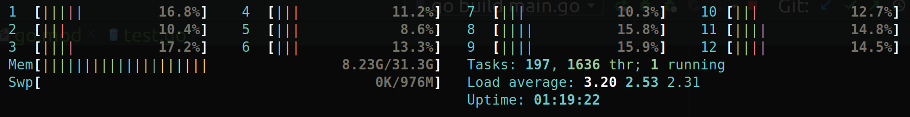

# 避免高 cpu 占用及 reflect.SelectCase

## 使用 go channel 唤醒程序

使用 go channel 唤醒程序，而非使用 for 循环空转。对比两种情况下的 cpu 占用情况：

1. 使用 for 循环空转

```go
func main() {
	ctx, cancel := context.WithDeadline(context.Background(), time.Now().Add(100 * time.Second))
	defer cancel()
	for {
	}
}
```


2. 使用 channel 唤醒

```go
func main() {
	ctx, cancel := context.WithDeadline(context.Background(), time.Now().Add(100 * time.Second))
	defer cancel()
	for {
		select {
		case <-ctx.Done():
			return
		}
	}
}
```



## 使用 reflect.SelectCase 进行动态多路唤醒

正常情况下可以使用 select 对多路 channel 进行唤醒，可是当 channel 数量或类型不定时，普通的 select 语句将不再使用（例如要对一个 channel 数组进行多路选择）。
此时，可以使用 reflect.SelectCase 进行动态多路选择。一个使用 SelectCase 对动态的 pulsar consumer 数组进行唤醒的示例如下：

```go
    cases := make([]reflect.SelectCase, len(ms.consumers))
	for i := 0; i < len(ms.consumers); i++ {
		ch := (*ms.consumers[i]).Chan()
		cases[i] = reflect.SelectCase{Dir: reflect.SelectRecv, Chan: reflect.ValueOf(ch)}
	}

	for {
		select {
		case <-ms.ctx.Done():
			log.Println("done")
			return
		default:
			for {
				chosen, value, ok := reflect.Select(cases)
				if !ok {
					log.Printf("channel closed")
					return
				}

				pulsarMsg, ok := value.Interface().(pulsar.ConsumerMessage)

				if !ok {
					log.Printf("type assertion failed, not consumer message type")
					continue
				}
				(*ms.consumers[chosen]).AckID(pulsarMsg.ID())

				headerMsg := internalPb.MsgHeader{}
				err := proto.Unmarshal(pulsarMsg.Payload(), &headerMsg)
				if err != nil {
					log.Printf("Failed to unmarshal message header, error = %v", err)
					continue
				}
			}
		}
	}
```
