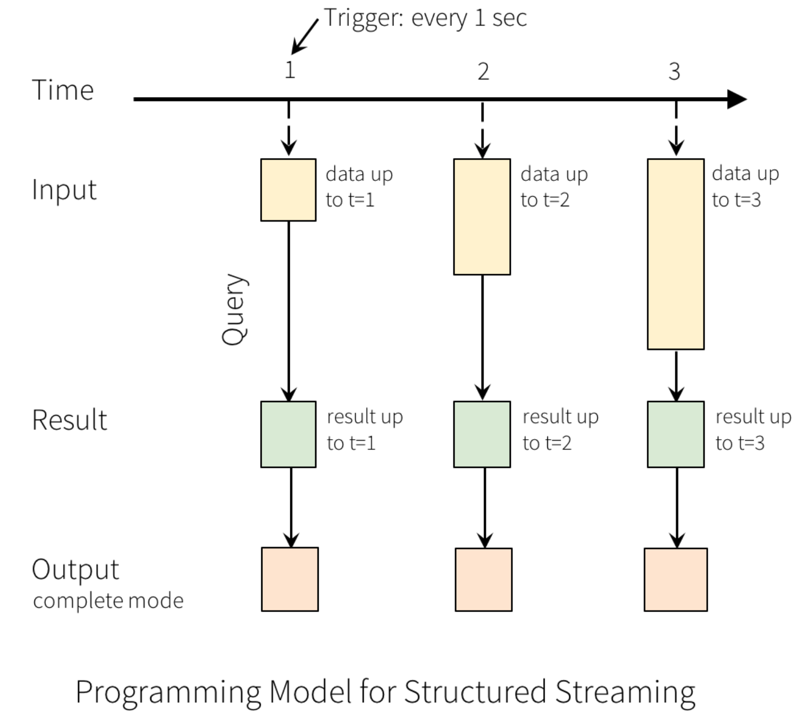
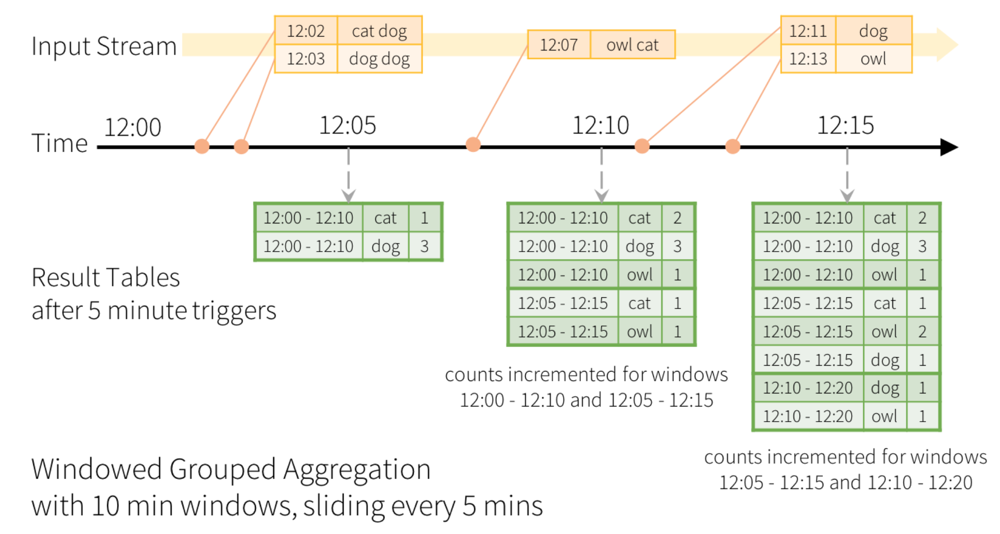

# Spark 结构化流

Spark 结构化流是基于 Spark SQL 引擎上的可扩展和具有容错性的流处理引擎。
可以通过 Dataframe API 实现 streaming aggregations, event-time windows, stream-to-batch joins 等操作。
通过 checkpointing 与 Write-Ahead Logs 机制，结构化流能够保证端到端只有一次且容错。

默认情况下，结构化流使用微批处理引擎来处理结构化流查询，微批的端到端延迟为 100 ms; 自 Spark 2.3 开始，spark 支持连续处理（Continuous Processing），连续处理的端到端延迟仅有 1 ms。

## 编程模型

结构化流的核心理念是将数据流（Data stream）当成是一个连续不断进行扩展的表（Unbounded Table）。

每个 interval time 时间内新增的时间都会被更新至输入表，经过计算后更新至结果表。

输出共有三种模式： 完全模式、扩展模式（默认）以及更新模式。完全模式会输出结果表中的所有数据，扩展模式仅仅会输出结果表中新增的数据，更新模式会输出结果表中被更改的以及新增的数据。

## 基于事件时间的窗口操作

窗口是基于 grouped aggregations 操作实现的，创建时需要制定窗口大小以及多久时间滑动一次。例如，对于大小为 10 分钟的窗口，每 5 分钟可以滑动窗口 [00:00 到 00:10), [00:05 到 00:15), [00:10 到 00:20) 等等。请注意， 窗口 1 和 2 重叠，窗口 2 和 3 重叠。 如果 EventTime 00:07 的事件进入，则该事件将属于窗口 [00:00 到 00:10) 和 [00:05 到 00:15)。

## 水印

设置 late threshold （延迟阀值），即能够容忍的最大传输延迟时间。水印即为处理接收的时间减去延迟阀值。若该时间大于 EventTime，则表示该时间应该被舍去而不做处理。例如，在 EventTime 12:09 发生的事件，若其在 12:13 被接收，而延迟阀值设为 5 分钟的话，其水印则为 12:13 - 5 = 12：08,还未大于 EventTime，则就应该处理此事件。

## 结构化流不支持的操作

- 多个流的 aggregations
- limit 操作
- distinct 操作
- 仅仅能在 aggregations 操作之后才能进行 sort 操作

## 触发器

触发器分为三种：Fixed interval micro-batches、One-time micro-batch、Continuous with fixed checkpoint interval。

- Fixed interval micro-batches。每个 interval 时间结束后都会查询是否有新的输入，若有更新则执行 query。例如，设置 interval 时间为 5 秒，则每过 5 秒就会查看是否有新的输入。
- One-time micro-batch。只会执行一次，执行之后便结束。
- Continuous with fixed checkpoint interval。基于 Continuous Processing 的触发器模式。延迟仅为 1 ms。

## 参考链接

主要参考：

<https://spark.apache.org/docs/3.0.0-preview/structured-streaming-programming-guide.html>

其它参考：

<https://ohmycloud.github.io/2018/11/27/a-tour-of-spark-structured-streaming/>
<https://zhuanlan.zhihu.com/p/51883927>
<https://spark.apache.org/docs/3.0.0-preview/structured-streaming-kafka-integration.html>
<https://databricks.com/blog/2017/04/04/real-time-end-to-end-integration-with-apache-kafka-in-apache-sparks-structured-streaming.html>
<https://databricks.com/blog/2016/07/28/structured-streaming-in-apache-spark.html>
<https://databricks.com/blog/2017/04/26/processing-data-in-apache-kafka-with-structured-streaming-in-apache-spark-2-2.html>